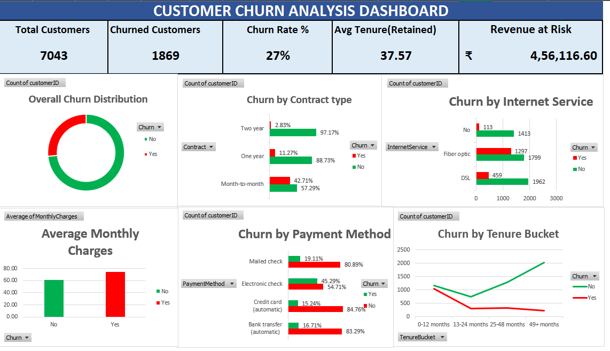

# FUTURE_DS_02
Customer Retention &amp; Churn Analysis Dashboard using Excel | Future Interns Internship Project
# Customer Retention & Churn Analysis Dashboard

## Internship Task
This project was completed as part of the Data Science & Analytics Internship at Future Interns.

## Objective
The objective of this project is to analyze customer churn data and identify:
- Customer churn patterns
- Retention drivers
- Revenue at risk
- Contract-based churn trends
- Payment behavior
- Customer tenure insights

## Tools Used
- Microsoft Excel
- Pivot Tables
- Pivot Charts
- Slicers
- Dashboard Design

## Dashboard Features
- Interactive churn analysis dashboard
- KPI cards for customer metrics
- Contract type churn analysis
- Internet service churn comparison
- Payment method analysis
- Tenure-based churn tracking
- Business insights and recommendations

## Key Metrics
- Total Customers: 7043
- Churned Customers: 1869
- Churn Rate: 27%
- Average Retained Tenure: 37.57
- Revenue at Risk: ₹4,56,116.60

## Key Insights
- Most churned customers are on month-to-month contracts.
- Customers with higher monthly charges churn more frequently.
- Early-tenure customers show the highest churn rates.
- Electronic check users churn most frequently.
- Fiber optic users have comparatively higher churn.

## Recommendations
- Offer discounts for yearly contracts.
- Improve onboarding for new customers.
- Encourage automatic payment methods.
- Provide loyalty rewards for high-risk customers.

## Files Included
- Excel dashboard file
- Pivot table analysis
- Dashboard screenshot

## Dashboard Preview

## Conclusion
This project helped in understanding:
- Customer retention analytics
- Churn analysis
- Business intelligence reporting
- Dashboard creation using Excel
- Insight-driven decision making

The dashboard provides actionable insights to reduce customer churn and improve customer retention strategies.
